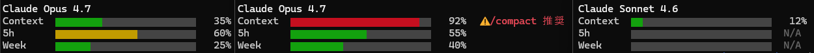
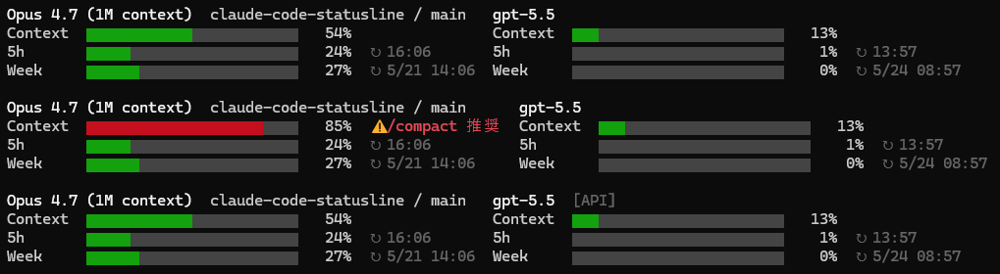

# claude-code-statusline

Claude Code 用のシンプルな Status Line。**モデル名・コンテキスト窓・5時間レートリミット・週次レートリミット**を、緑/黄/赤の段階色つきバーで入力欄の直下に常時表示します。



## 特徴

- 4 行のコンパクトな表示（モデル名 + バー 3本）
- バーは下 3/4 ブロック (`▆`) で太く・行間に隙間
- **段階色**: 〜59% 緑 / 60〜79% 黄 / 80%〜 赤
- **コンテキスト 80% 以上で `⚠ /compact 推奨` を末尾に表示**
- **5h / Week バーの末尾に次回リセット時刻 (`↻ HH:MM` / `↻ M/D HH:MM`) をローカル時刻で表示**
- **モデル名の右に `repo名/branch名` を表示**（Git リポジトリ内のとき）
- **API 利用時のみ累計コスト `$X.XX` を末尾に表示**（サブスクリプション利用時は非表示）
- レートリミット情報が無いとき（非サブスク・初回起動直後など）は `N/A` でフォールバック
- 標準ライブラリのみ（外部依存なし）
- **補助機能（opt-in）**: Codex CLI のレート残量を並置表示など。default OFF、明示フラグ指定時のみ動作（詳細は [補助機能](#補助機能) 章）

## 表示内容

| 行 | 内容 | データソース |
|----|------|----|
| 1 | モデル名（太字）+ `repo名/branch名` + `$コスト`（API利用時のみ） | `model.display_name` / `workspace.project_dir` + `git rev-parse` / `cost.total_cost_usd` |
| 2 | Context バー + % | `context_window.used_percentage` |
| 3 | 5h バー + % + ↻ リセット時刻 | `rate_limits.five_hour.used_percentage` / `.resets_at` |
| 4 | Week バー + % + ↻ リセット時刻 | `rate_limits.seven_day.used_percentage` / `.resets_at` |

5h / Week は Claude Code から渡される値をそのまま使うため、**サブスクリプションの実際の残量と一致**します。値が無いときは自動で `N/A` 表示にフォールバックします。

`resets_at` は Unix epoch 秒で渡されるため、本スクリプトは **ローカルタイムゾーンに変換** して表示します。5h は当日内に必ず収まるため `HH:MM` のみ、Week は数日先まで延びるため `M/D HH:MM` 形式で表示します。`resets_at` だけが欠けている場合は時刻表記を省略し、% のみ表示します。

リポジトリ名は `workspace.project_dir` の basename、ブランチ名は `git rev-parse --abbrev-ref HEAD`（detached HEAD 時は短縮 SHA にフォールバック）から取得します。Git リポジトリ外ではディレクトリ名のみを表示します。

コスト表示は **API キー利用が確実なとき**（= サブスクリプション判定が成立しないとき）のみ出ます。判定は次の二段です:

1. 現在の JSON に `rate_limits` があれば即サブスク扱い
2. 過去に同 `session_id` で一度でも `rate_limits` を観測していればサブスク扱い（`~/.cache/claude-code-statusline/<session_id>.subscription` に空ファイルで記録）

この二段判定により、`/compact` 直後など `rate_limits` が一時的に欠落するフレームでもサブスク利用者にコストが漏れません。マーカーは 0 バイトの空ファイルで、不要になったら `~/.cache/claude-code-statusline/` ごと削除して問題ありません。

## 必要環境

- Claude Code
- Python 3.8 以上
- 256 色対応の等幅フォントを表示できるターミナル（Windows Terminal / VS Code 統合ターミナル / Alacritty / iTerm2 など最近のものはほぼ対応）

## インストール

### 1. スクリプトを配置

**方法A: 1ファイルだけ取得（最速・推奨）**

```bash
curl -L https://raw.githubusercontent.com/YATA-NODE/claude-code-statusline/main/statusline.py -o ~/.claude/statusline.py
```

**方法B: clone してからコピー**

```bash
git clone https://github.com/YATA-NODE/claude-code-statusline.git
cp claude-code-statusline/statusline.py ~/.claude/statusline.py
```

### 2. `~/.claude/settings.json` に `statusLine` を追記

```json
{
  "statusLine": {
    "type": "command",
    "command": "python3 /home/<your-user>/.claude/statusline.py",
    "padding": 0,
    "refreshInterval": 60000
  }
}
```

`/home/<your-user>/` の部分は実際のホームディレクトリ絶対パスに置き換えてください。`~` は展開されないので注意。

### 3. Claude Code を再起動

```bash
/exit
claude --continue
```

## カスタマイズ

`statusline.py` の冒頭に主要な定数があります。書き換えるだけで挙動を変えられます。

| 定数 | デフォルト | 用途 |
|------|----------|------|
| `BAR_WIDTH` | `24` | バーの横幅（セル数） |
| `LABEL_WIDTH` | `9` | 左側ラベルの最小幅 |
| `FILL_CHAR` | `▆` | 埋めセル（下3/4ブロック） |
| `EMPTY_CHAR` | `▆` | 空セル（同形・色のみ違う） |
| `EMPTY_COLOR` | `\033[38;5;238m` | 空セルの色（xterm-256 の暗いグレー） |

### 段階色の閾値を変える

`color_for()` 内の `60` / `80` を変更：

```python
def color_for(pct: int) -> str:
    if pct < 0:    return "\033[90m"
    if pct < 60:   return "\033[32m"   # ← 緑の上限
    if pct < 80:   return "\033[33m"   # ← 黄の上限
    return "\033[31m"
```

### `/compact` 推奨警告の閾値を変える

`main()` 内の `80` を変更：

```python
if label == "Context" and pct >= 80:
    line += f"  \033[1;31m⚠ /compact 推奨\033[0m"
```

### 256 色非対応の端末で空セルが表示されない場合

`EMPTY_COLOR` を 16 色互換に変更：

```python
EMPTY_COLOR = "\033[90m"   # bright black (16色)
```

## 補助機能

opt-in で有効化する追加機能群。**標準機能(上記 4 本柱)とは独立**しており、コマンドライン引数で明示的に有効化したときのみ動作・I/O 発生。default は OFF なので、何も指定しなければ標準機能だけが動きます。



### Codex CLI 並置表示 (`--codex`)

Claude Code に加えて [Codex CLI](https://github.com/openai/codex) を併用しているとき、`--codex` フラグを付けると Codex 側のモデル名・コンテキスト使用率・5h レート残量・週次レート残量を **右側に並置表示** します（既存 4 本柱は左側そのまま）。default OFF なので、未指定時は完全に従来動作（Codex 関連の I/O も発生しません）。

#### 有効化

`~/.claude/settings.json` の `command` に `--codex` と、自分のターミナル幅に合わせた `--width <N>` を足します:

```json
{
  "statusLine": {
    "type": "command",
    "command": "python3 /home/<your-user>/.claude/statusline.py --codex --width 200",
    "padding": 0,
    "refreshInterval": 60000
  }
}
```

`--width` を **強く推奨** します。Claude Code の statusLine 実行環境では stdin/stdout/stderr がパイプ化されており、`os.get_terminal_size` で端末幅を取得できないことが多く、fallback の 80 cells と判定されて右ブロックが silent skip される(=画像と異なり何も右に出ない)ためです。自分のターミナルの実幅を指定してください(WSL2 + Windows Terminal 最大化なら 200-280 程度、VS Code 統合ターミナルなら 150-200 程度が目安。分からなければ 200 で試して見え方で調整)。

代替として環境変数 `STATUSLINE_COLUMNS=200` を `command` の前に置く方法もあります(`"command": "STATUSLINE_COLUMNS=200 python3 ..."`)。

**tmux 内では自動追従**: `$TMUX` 環境変数が設定されているとき、`tmux display-message -p '#{pane_width}'` で **現 pane の幅を毎ターン動的取得** します。pane 分割を増減しても次のターンで自動追従。tmux と通常ターミナルを併用する場合、`--width 280`(通常ターミナル最大幅)を設定しておけば、tmux 内では自動的に pane 幅が優先されます。

優先順位(高い順):
1. **tmux pane_width**(`$TMUX` が set で `tmux display-message` 成功時)
2. `--width N` CLI 引数
3. `STATUSLINE_COLUMNS` 環境変数
4. `COLUMNS` 環境変数
5. TTY fd 試行(stderr/stdout/stdin)
6. fallback(80)

CLI 引数より tmux 検知を優先するのは異例ですが、pane 内では物理画面幅が pane_width に制限されるため、`--width` の固定値を信じると tmux pane で必ず折り返すためです。

#### 表示崩壊回避の精度

全角文字(日本語、絵文字など)を含む行のセル幅は `unicodedata.east_asian_width` で計算しているため、`⚠ /compact 推奨` のような全角混在行でも右ブロックは正しく押し出され、重なりません。

#### 取得元

`~/.codex/sessions/YYYY/MM/DD/*.jsonl` の **当日 + 前日の全ファイルを mtime 降順で走査** し、

| 項目 | 取得経路 |
|------|----------|
| モデル名 | 最初に見つかった `type:"turn_context"` 行の `payload.model`(最新セッションの `/model` 切替に追従) |
| Context % | `token_count` イベントを含む最初のファイル内、最後の `event_msg / payload.type=="token_count"` の `info.total_token_usage.total_tokens` ÷ `info.model_context_window` |
| 5h 残量 + リセット時刻 | 同イベントの `payload.rate_limits.primary.used_percent` / `.resets_at` |
| Week 残量 + リセット時刻 | 同イベントの `payload.rate_limits.secondary.used_percent` / `.resets_at` |

両方が揃った時点で走査を停止します(typical には最新 1-2 ファイルで完結)。最新 jsonl に `token_count` イベントがない場合(例: クォータ超過で応答なし)も、過去のセッションから **最後に判明していた残量** を表示するため、サブスクユーザーは新規 Codex セッションを起動する前に「あと使えるか」を確認できます。

read-only で読むだけで、Codex 側に書き込みは行いません。

#### API キー利用時の認識補助表示（`[API]` マーカー）

Codex CLI が **API キー認証**(`codex login --with-api-key`)で動作しているとき、モデル名の右に薄字で `[API]` マーカーを表示します。サブスクリプション認証で動作しているときは表示されません。

判定は `~/.codex/auth.json` の `OPENAI_API_KEY` フィールドの **存在のみ** を見て行います(キー本体の文字列内容は読み取り・出力・ログ出力のいずれにも使いません、`isinstance(key, str) and len(key) > 0` の bool 化のみ):

| 状況 | `~/.codex/auth.json` の `OPENAI_API_KEY` | 表示 |
|------|----|----|
| サブスクリプション認証 | `null`(string なし) | `[API]` 非表示 |
| API キー認証 | string(値あり) | `[API]` 表示 |
| ファイル不在 / 読み取り失敗 / JSON 破損 | - | `[API]` 非表示(安全側、誤情報ゼロ) |

判定は **現在の認証状態を直接見る** ため、認証切替(`codex login --with-api-key` ↔ `codex login`)は次の statusline refresh(最大 60 秒)で反映されます。古い Codex セッション jsonl が残っていても誤検出しません。

この表示は **「Codex が API 課金中であること」をユーザーに視覚的に伝える** ための認識補助です（Claude 側で API キー利用時に累計コスト `$X.XX` を表示するのと対応する仕組み）。「API」は区分の総称表記で、プラン固有名は本スクリプトの表示出力に一切登場しません。

#### 値が取れないバーの扱い(認証モードで挙動が異なる)

- **サブスクリプション認証**: Context / 5h / Week は **常に 3 行表示**(値が取れない場合は `N/A` として表示)。レートリミットの残量とリセット時刻は「いつまた Codex が使えるか」の意思決定情報なので、一時的に値が取れない場合(例: 古い API モード jsonl が最新で `token_count` イベントなし、認証はサブスクリプションに戻している等)でも `N/A` で行は残します
- **API キー認証**: Context / 5h / Week のうち値が取れないバーは **そのバーだけ表示せずスキップ**(レートリミットは API 課金には概念として存在しない = 無価値な `N/A` を並べない方がコンパクト)
  - API キー認証 + 正常応答(Context 取得可) → 2 行表示(モデル名 `[API]` + Context)
  - API キー認証 + クォータ超過などで `token_count` イベント不在 → 1 行表示(モデル名 `[API]` のみ)

#### 自動フォールバック（表示崩壊回避）

既存 4 本柱の表示を絶対に崩さないため、以下のケースで **右ブロックだけ静かに非表示**（左側は通常通り）にします:

- `~/.codex/` が存在しない（Codex 未インストール）
- 当日と前日のどちらにも session jsonl が無い
- jsonl からモデル名もレートリミット情報も一切取得できなかった（ファイル読込失敗 / 全行壊れている / 期待形式不在）
- 端末幅が `120` セル未満（または `左幅 + 2 + 右幅 > 端末幅`）

各行の `json.loads` は寛容パース（壊れた行はその行だけスキップ）で、後段の有効な `turn_context` / `token_count` が一つでも取れれば、取れた範囲で表示します。モデル名は ANSI/OSC 等の端末制御文字を除去のうえ最大 32 文字に切り詰めて表示します。

端末幅は `$COLUMNS` → `stderr/stdout/stdin` の TTY fd → fallback の順で判定します。Claude Code から渡される JSON には端末幅情報が無いため、ターミナルアプリの幅を直接見ています。

## 動作の仕組み

Claude Code は `statusLine.command` で指定されたシェルコマンドを定期的に実行し、その標準出力を入力欄の下に表示します。stdin からは現在のセッション情報が JSON で渡されます（`model`, `context_window`, `rate_limits`, `cost`, `workspace`, `transcript_path` 等）。本スクリプトは `model` / `workspace` / `cost` / `context_window` / `rate_limits` を読み取り、必要に応じて `git rev-parse` を 1 回呼んでブランチ名を取得します。

## ライセンス

MIT License — 詳細は [LICENSE](LICENSE) を参照してください。

---

# claude-code-statusline (English)

A simple Status Line for [Claude Code](https://claude.com/claude-code) that displays the **model name, context window usage, 5-hour rate limit, and 7-day rate limit** as color-graded bars (green / yellow / red) right under the input prompt.


## Features

- Compact 4-line layout (model name + 3 bars)
- Bars use the lower-three-quarters block (`▆`) for visual weight with breathing room between rows
- **Stage colors**: 0–59% green / 60–79% yellow / 80%+ red
- **Shows `⚠ /compact 推奨` next to the Context bar when context usage reaches 80%**
- **Shows the next reset time (`↻ HH:MM` / `↻ M/D HH:MM`, local timezone) at the right end of the 5h / Week bars**
- **Shows `repo/branch` to the right of the model name** when inside a Git repository
- **Shows accumulated `$X.XX` cost only when using the API** (hidden for Claude.ai subscription users)
- Falls back to `N/A` when rate-limit info is unavailable (e.g. non-subscribers, fresh sessions)
- Pure standard library — no external dependencies
- **Auxiliary features (opt-in)**: side-by-side Codex CLI rate display, etc. Default OFF; only active when explicit flags are given (see [Auxiliary features](#auxiliary-features))

## Display contents

| Row | Content | Source field |
|----|------|----|
| 1 | Model name (bold) + `repo/branch` + `$cost` (API only) | `model.display_name` / `workspace.project_dir` + `git rev-parse` / `cost.total_cost_usd` |
| 2 | Context bar + % | `context_window.used_percentage` |
| 3 | 5h bar + % + ↻ reset time | `rate_limits.five_hour.used_percentage` / `.resets_at` |
| 4 | Week bar + % + ↻ reset time | `rate_limits.seven_day.used_percentage` / `.resets_at` |

The 5h / Week values are passed in directly by Claude Code, so they reflect the **actual subscription remaining**. Missing values fall back to `N/A`.

`resets_at` is provided as a Unix epoch seconds integer, so this script converts it to **the local timezone** for display. The 5h reset always falls within the current day, so it is shown as `HH:MM`; the weekly reset can be several days out, so it is shown as `M/D HH:MM`. If only `resets_at` is missing while `used_percentage` is present, the timestamp is omitted and only the percentage is shown.

The repository name is the basename of `workspace.project_dir`; the branch name comes from `git rev-parse --abbrev-ref HEAD` (falling back to a short SHA when in detached HEAD state). Outside a Git repository, only the directory name is shown.

The cost is shown only when **API-key usage is certain** (i.e. when the subscription check below fails). The subscription check is two-step:

1. If the current JSON contains `rate_limits`, treat as subscription immediately.
2. If `rate_limits` was ever seen previously in the same `session_id`, treat as subscription (recorded as an empty file at `~/.cache/claude-code-statusline/<session_id>.subscription`).

This two-step check prevents cost from leaking to subscription users on frames where `rate_limits` is briefly missing (e.g. right after `/compact`). The marker is a 0-byte empty file; you can delete `~/.cache/claude-code-statusline/` anytime when it is no longer needed.

## Requirements

- Claude Code
- Python 3.8+
- A 256-color capable terminal with a monospace font that renders Unicode block characters cleanly (modern terminals like Windows Terminal, VS Code's integrated terminal, Alacritty, iTerm2 all work)

## Installation

### 1. Place the script

**Option A: Grab the single file (fastest, recommended)**

```bash
curl -L https://raw.githubusercontent.com/YATA-NODE/claude-code-statusline/main/statusline.py -o ~/.claude/statusline.py
```

**Option B: Clone, then copy**

```bash
git clone https://github.com/YATA-NODE/claude-code-statusline.git
cp claude-code-statusline/statusline.py ~/.claude/statusline.py
```

### 2. Add `statusLine` to `~/.claude/settings.json`

```json
{
  "statusLine": {
    "type": "command",
    "command": "python3 /home/<your-user>/.claude/statusline.py",
    "padding": 0,
    "refreshInterval": 60000
  }
}
```

Replace `/home/<your-user>/` with your actual home directory absolute path. `~` is **not** expanded here.

### 3. Restart Claude Code

```bash
/exit
claude --continue
```

## Customization

Key constants live near the top of `statusline.py`:

| Constant | Default | Purpose |
|------|----------|------|
| `BAR_WIDTH` | `24` | Bar width in cells |
| `LABEL_WIDTH` | `9` | Minimum width of the left-side label column |
| `FILL_CHAR` | `▆` | Filled cell (lower three quarters block) |
| `EMPTY_CHAR` | `▆` | Empty cell (same shape, only color differs) |
| `EMPTY_COLOR` | `\033[38;5;238m` | Color for empty cells (xterm-256 dark gray) |

### Change stage-color thresholds

Edit `60` / `80` inside `color_for()`:

```python
def color_for(pct: int) -> str:
    if pct < 0:    return "\033[90m"
    if pct < 60:   return "\033[32m"   # green upper bound
    if pct < 80:   return "\033[33m"   # yellow upper bound
    return "\033[31m"
```

### Change the `/compact` warning threshold

Edit `80` inside `main()`:

```python
if label == "Context" and pct >= 80:
    line += f"  \033[1;31m⚠ /compact 推奨\033[0m"
```

### Fallback for terminals without 256-color support

Switch `EMPTY_COLOR` to a 16-color value:

```python
EMPTY_COLOR = "\033[90m"   # bright black (16 colors)
```

## Auxiliary features

Opt-in extensions that activate only when explicitly enabled via command-line flags. They are **fully independent from the core 4-line layout** above — no I/O, no behavior change unless you opt in.


### Codex CLI side-by-side display (`--codex`)

If you also use [Codex CLI](https://github.com/openai/codex) alongside Claude Code, adding `--codex` shows Codex's **model name, context %, 5h primary rate, and weekly secondary rate** as a second column to the right (the existing 4-line layout stays unchanged on the left). Default is OFF — when the flag is absent, no Codex-related I/O happens at all.

#### Enable

Add `--codex` and `--width <N>` (your actual terminal width) to the `command` in `~/.claude/settings.json`:

```json
{
  "statusLine": {
    "type": "command",
    "command": "python3 /home/<your-user>/.claude/statusline.py --codex --width 200",
    "padding": 0,
    "refreshInterval": 60000
  }
}
```

`--width` is **strongly recommended**. Under the Claude Code statusLine runner, stdin/stdout/stderr are all piped, so `os.get_terminal_size` typically fails and the script falls back to 80 cells — which silently hides the right column (nothing shows on the right). Pass your actual terminal width (WSL2 + Windows Terminal maximized: 200–280, VS Code integrated terminal: 150–200; if unsure, start with 200 and adjust).

Alternatively, set the environment variable `STATUSLINE_COLUMNS=200` in front of the command (`"command": "STATUSLINE_COLUMNS=200 python3 ..."`).

**Auto-follow inside tmux**: when `$TMUX` is set, the script queries `tmux display-message -p '#{pane_width}'` to **fetch the current pane width on every tick**. Splitting / unsplitting panes is picked up on the next tick automatically. If you mix tmux with bare terminal, just set `--width 280` (your max bare-terminal width) once — inside tmux the dynamic pane width takes over.

Resolution order (highest first):
1. **tmux pane_width** (when `$TMUX` is set and `tmux display-message` succeeds)
2. `--width N` CLI flag
3. `STATUSLINE_COLUMNS` env
4. `COLUMNS` env
5. TTY fd probe (stderr/stdout/stdin)
6. fallback (80)

Putting tmux above the CLI flag is unusual, but a pane's physical render width is hard-capped at `pane_width` — trusting a larger `--width` inside a pane would always wrap.

#### Why the right column never overlaps

Cell widths for full-width characters (CJK, emoji) are computed via `unicodedata.east_asian_width`, so a line like `⚠ /compact 推奨` (which mixes ASCII and Japanese) is measured correctly and the right block is pushed out without overlap.

#### Data source

Walks **all** `~/.codex/sessions/YYYY/MM/DD/*.jsonl` files for today + yesterday in **mtime-desc order**:

| Item | Source |
|------|--------|
| Model name | The first `type:"turn_context"` line found (tracks the latest session's `/model` switch) |
| Context % | The last `event_msg / payload.type=="token_count"` line in the first file that has any: `info.total_token_usage.total_tokens` ÷ `info.model_context_window` |
| 5h usage + reset | Same event: `payload.rate_limits.primary.used_percent` / `.resets_at` |
| Week usage + reset | Same event: `payload.rate_limits.secondary.used_percent` / `.resets_at` |

The walk short-circuits once both `model` and `token_count` are found (typically 1-2 files). When the most-recent jsonl has no `token_count` event (e.g. quota-exceeded with no response), the extractor falls back to an earlier jsonl to surface the **last known budget state**, so subscription users can check "how much is left" before starting a new Codex session.

Read-only. Nothing is written back to Codex's session files.

#### API key auth indicator (`[API]` marker)

When Codex CLI is running with **API key authentication** (`codex login --with-api-key`), `[API]` is shown in dim gray right after the model name. Subscription-authenticated sessions do not show this marker.

Detection reads `~/.codex/auth.json` and checks **only whether the `OPENAI_API_KEY` field is a non-empty string** — the key's string content is never read into any variable used for output, comparison, or logging (only `isinstance(key, str) and len(key) > 0` is evaluated):

| Auth state | `OPENAI_API_KEY` in `auth.json` | Display |
|------|----|----|
| Subscription auth | `null` (no string) | No `[API]` |
| API key auth | string (value present) | `[API]` shown |
| File missing / read error / JSON parse error | - | No `[API]` (fail-safe; no false positives) |

Because detection reads the **live auth state** directly, switching auth (`codex login --with-api-key` ↔ `codex login`) is reflected on the next statusline refresh (within 60s). Stale Codex session jsonl files do not cause false positives.

This is a **visual cue that Codex is billing through the API** (mirroring the Claude-side convention where `$X.XX` cost is shown for API-key users). The label "API" is intentionally generic; no subscription plan proper nouns appear in any output.

#### Missing-value behavior (auth-mode dependent)

- **Subscription auth**: Context / 5h / Week are **always rendered as 3 rows** (with `N/A` when a value cannot be computed). Rate-limit remaining and reset times are decision info for the user ("when can I use Codex again?"), so even when a single tick briefly lacks data (e.g. the latest jsonl is a stale API-mode one with no `token_count` event while `auth.json` shows you're back on subscription), the rows stay visible as `N/A` so the layout doesn't jump.
- **API key auth**: Rows whose values cannot be computed are **omitted individually** (rate limits aren't a concept under usage-based billing, so empty `N/A` rows would just be visual noise).
  - API key auth + successful response (Context can be computed) → 2 rows (model name `[API]` + Context)
  - API key auth + quota exceeded etc. (no `token_count` event at all) → 1 row (model name `[API]` only)

#### Auto-fallback (never break the existing layout)

To guarantee the existing 4-line layout never breaks, the right column is **silently hidden** (left side stays normal) in any of:

- `~/.codex/` does not exist (Codex not installed)
- No session jsonl exists for today or yesterday
- Neither a model name nor rate limit info could be extracted from the jsonl (file read failed / every line malformed / expected shapes absent)
- Terminal width < `120` cells, or `left_width + 2 + right_width > terminal_width`

Per-line `json.loads` is lenient (a single broken line is just skipped); if at least one valid `turn_context` / `token_count` is found later, the right column is rendered with whatever was extracted. The model name is sanitized of ANSI/OSC and other terminal control sequences and truncated to 32 characters before display.

Terminal width is detected via `$COLUMNS` → `stderr/stdout/stdin` TTY fd → fallback (the Claude Code statusLine JSON does not include terminal width, so we look at the terminal app directly).

## How it works

Claude Code periodically runs the command in `statusLine.command` and renders its stdout right below the input prompt. The current session info is provided to stdin as JSON (`model`, `context_window`, `rate_limits`, `cost`, `workspace`, `transcript_path`, etc.). This script reads `model` / `workspace` / `cost` / `context_window` / `rate_limits`, and additionally invokes `git rev-parse` once to resolve the branch name when needed.

## License

MIT License — see [LICENSE](LICENSE) for details.
